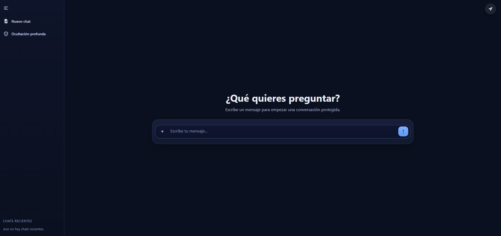
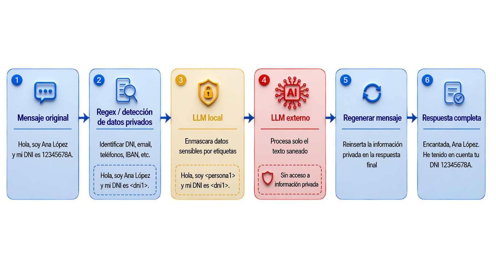
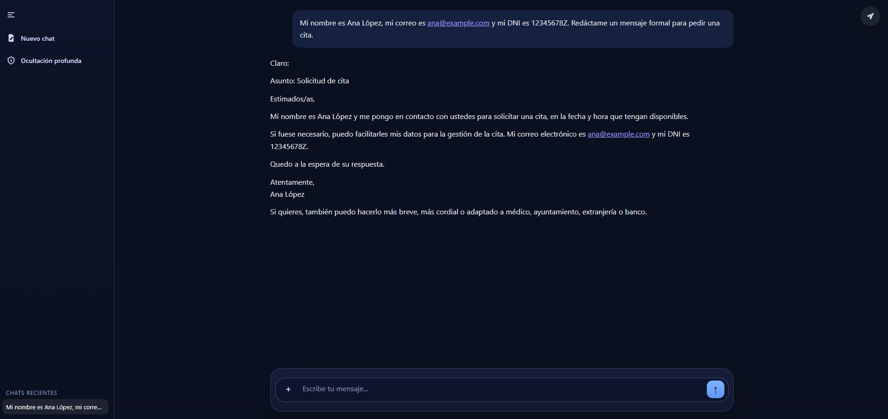
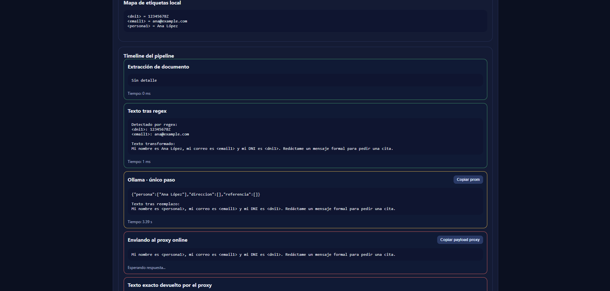
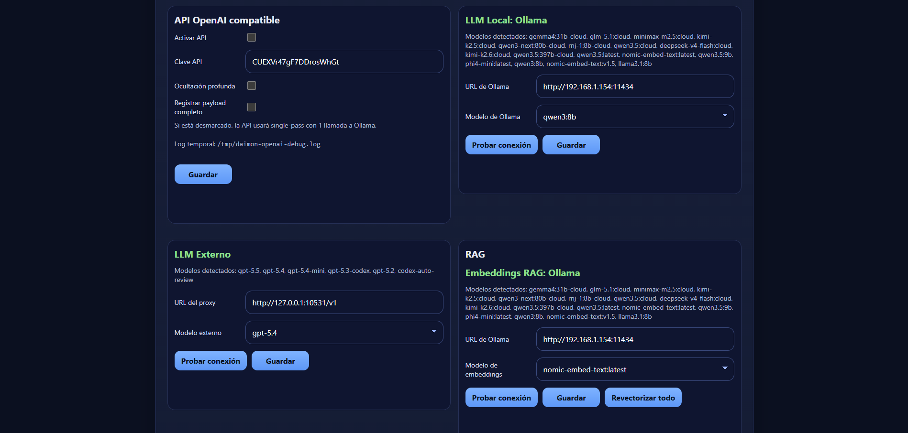

<div align="center">
  
  <h1> Daimon </h1>
</div>

Proyecto construido con **OpenClaw + ChatGPT Codex**.

> **PROTEGE EL TEXTO SENSIBLE ANTES DE QUE LLEGUE A LLM EXTERNOS**

Daimon es un servicio local que se coloca entre el usuario y un LLM externo para reducir la exposición de datos privados.

En vez de enviar el mensaje original directamente al modelo remoto, Daimon lo procesa en local, sustituye el contenido sensible por etiquetas y solo entonces envía la versión saneada.

Cuando llega la respuesta del LLM externo, Daimon reconstruye el contenido final usando los datos privados originales que nunca salieron del entorno local.



---

## Cuándo usar Daimon

Daimon encaja especialmente bien si quieres:

- redactar texto privado antes de usar un LLM externo
- proteger contraseñas, credenciales, identificadores o datos internos
- combinar privacidad local con calidad remota
- añadir RAG privado sin exponer directamente toda la base documental
- usar un endpoint compatible con OpenAI con una capa local de saneado

Tipos de datos que Daimon puede ayudar a ocultar o sanear:

- contraseñas
- credenciales y tokens
- DNI, NIE y CIF
- teléfonos
- correos electrónicos
- IBAN
- datos de tarjeta y pago
- matrículas
- nombres de personas
- calles o direcciones
- referencias numéricas
- otros identificadores o datos internos

Esta protección se puede personalizar desde `http://localhost:3010/config`, ajustando reglas, prompts y comportamiento del saneado.

---

## Flujo completo

```text
Mensaje original del usuario
  -> detección de patrones sensibles con regex
  -> saneado adicional con LLM local
  -> sustitución por etiquetas estables
  -> envío del texto saneado al LLM externo
  -> recepción de la respuesta remota
  -> reconstrucción local con los datos privados originales
  -> respuesta final para el usuario
```


---

## Inicio rápido

### 1. Crear `docker-compose.yml`

Usa esta configuración:

```yaml
services:
  openai-oauth:
    container_name: openai-oauth
    image: ar0per0/openai-oauth
    restart: unless-stopped
    ports:
      - "10531:10531"
    volumes:
      - openai-oauth:/data

  daimon:
    container_name: daimon
    image: ar0per0/daimon
    restart: unless-stopped
    ports:
      - "3010:3010"
    volumes:
      - daimon:/app/data

volumes:
  openai-oauth:
  daimon:
```

### 2. Levantar todo

Ejecuta:

```bash
docker compose up -d
```

Este comando levanta:

- `openai-oauth` en `10531`
- `daimon` en `3010`

### 3. Enlazar primero `openai-oauth` con el LLM externo

Antes de usar Daimon, primero tienes que completar la conexión de `openai-oauth` con el LLM externo.

Consulta el código o enlace generado por `openai-oauth` con:

```bash
docker logs openai-oauth
```

Usa ese código o enlace para completar la autenticación con el proveedor externo.

Cuando ese paso termine correctamente, `openai-oauth` quedará listo para que Daimon lo use como conexión local hacia el LLM externo.

### 4. Abrir la interfaz

Abre en el navegador:

- `http://localhost:3010` — interfaz principal de chat para hablar con Daimon. Desde aquí se crean conversaciones, se envían mensajes y se usa el flujo normal del sistema con modo protegido, local o remoto.


- `http://localhost:3010/debug` — vista de depuración para ver qué se sanea, qué sale al remoto y cómo responde el pipeline. Es la pantalla útil para inspeccionar el proceso interno y validar que la protección está funcionando como esperas.


- `http://localhost:3010/config` — panel de configuración para modelos, reglas, prompts, RAG y opciones generales. Desde aquí se ajusta el comportamiento del saneado, la conexión con los servicios y las opciones del sistema.


Credenciales iniciales del panel de configuración:

- password: `1234`

---

## Documentación

La documentación detallada está en [`docs/`](./docs/README.md):

- [Visión general](./docs/overview.md)
- [Primeros pasos](./docs/getting-started.md)
- [Arquitectura](./docs/architecture.md)
- [Configuración](./docs/configuration.md)
- [RAG](./docs/rag.md)
- [Docker](./docs/docker.md)
- [API](./docs/api.md)

---

## Nota de seguridad

Daimon es una capa de reducción de riesgo.

No garantiza seguridad perfecta.

La seguridad final depende de varios factores:

- la calidad de las reglas regex
- la calidad del saneado del modelo local
- la configuración del entorno
- el uso del modelo externo

No expongas Daimon directamente a internet sin controles adicionales.
